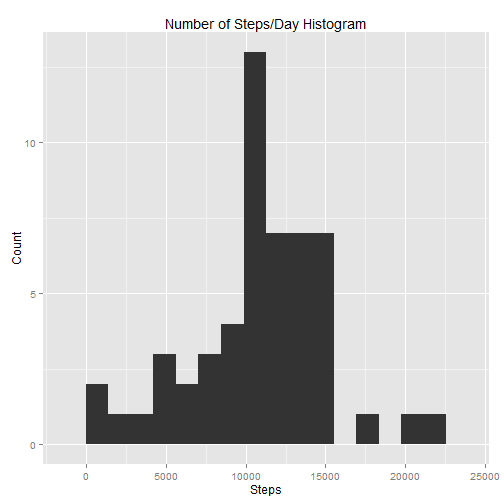
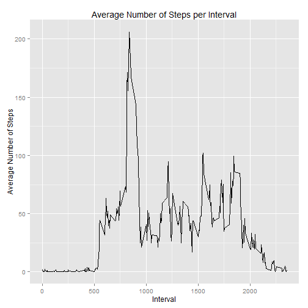
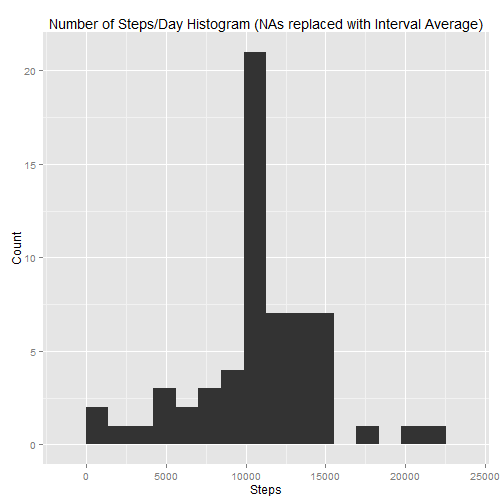
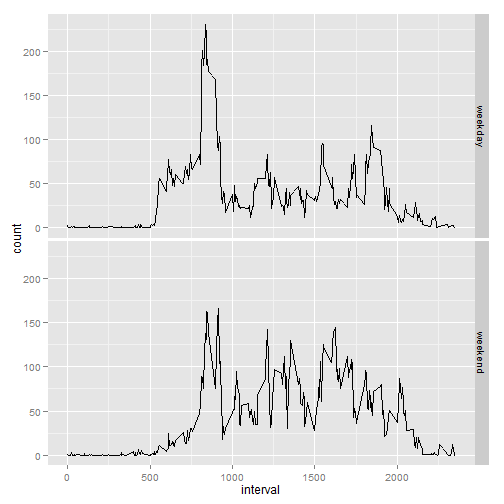

##Reproducable Research - Peer Assignment 1

This document describes the process and results for Peer Assessment 1.

Questions will be answered and code segments will be shown inline.

###Loading and Preprocessing the Data

The first ask is to load the data and process it into a usable form.

Start by loading some useful libraries - lubridate for dates, ggplot2 for graphics, tidyr for tidying and splitting data into multiple columns.  Although the data set actually started pretty tidy, it gets messy (then cleaned again) while aggregating.  I'll likely rewrite this as a personal exersize at some point to use dplry and keep it tidy all the way through but this works for now.

After loading libraries, transform the data, pull out weekdays, remove NAs for the first section.  More details are in the code segment below.


```r
#reproducible research working file
#kevin simon, 2014-11-07
#Load some useful libraries
library(lubridate)
library(ggplot2)
library(tidyr)

#read the CSV, convert the date to something recognizable as such, and pull out the weekdays for later 
data <- read.csv("activity.csv")
data$date <- ymd(as.character(data$date))
data$dow <- wday(data$date)

#Remove the NAs for the first bit
dataNoNa <- data[!is.na(data$steps),]
```

##What is mean total number of steps taken per day?

Split, apply, combine to build the first graph.  See comments in the code section below for details.


```r
#split the data out by dates
dataByDay <- split(dataNoNa, dataNoNa$date)

#get a total for each date
dailySumSteps <- sapply(dataByDay, function (i) {sum(i$steps)})

#Build the histogram.  Easy wih the base system, for practice I decided to use ggplot2. First step is to  figure out a bin size that's reasonable - I want about 15 bins.
#hist(dailySumSteps, xlab="Steps", main = "Number of Steps/Day Histogram")
binsize <- diff(range(dailySumSteps))/15
#Then plot. Add some labels and print it.
p <- qplot(dailySumSteps, binwidth = binsize, xlab="Steps", main = "Number of Steps/Day Histogram", ylab="Count")
print(p)
```

 

OK, the next ask is to calculate the mean and median.


```r
#Calculate the mean and median daily number of steps
stepsMean <- mean(dailySumSteps)
stepsMedian <- median(dailySumSteps)
```

The mean is 1.0766189 &times; 10<sup>4</sup>.  
The median is 10765.

##What is the average daily activity pattern?

The next ask is to build a time series plot of what the interval averages across all days looks like.

Same as before, use split, apply, combine to separate the data into intervals, average the intervals, and put them back into a data frame.

Again, I used ggplot2 for practice.


```r
#split the data out by intervals
dataByInterval <- split(dataNoNa, dataNoNa$interval)

#calcualte the averages and put them back into a data frame
averageInterval <- sapply(dataByInterval, function (i) {mean(i$steps)})
averageInterval <- data.frame(name = as.numeric(names(averageInterval)), count = as.numeric(averageInterval))

#Make the plot and print it!
p <- qplot(averageInterval$name, averageInterval$count, geom="line", xlab="Interval", ylab="Average Number of Steps", main="Average Number of Steps per Interval")
print(p)
```

 

Intersting shape to this plot.  Looks like the subject gets up and walks to whatever they do during the day around 0830.  There is no corresponding spike at a fixed time in the evening, so maybe a student getting to class at the same time each day, but with a variable end-of-day?

The next ask is the max interval.


```r
#get the max interval
maxInterval <- averageInterval[which.max (averageInterval$count),1]
```

The interval with the highest average number of steps is 835.
Next, count NAs.


```r
#Count NAs
countNa <- sum(is.na(data))
```

##Imputing missing values

The next section lets the data scientist pick the method for filling in the NAs.  I chose to fill them in with the average for that interval.  At some point, I may rewrite this to use the average interval by daytype as the later exercises seem to indicate that this may be more accurate.  For now, this will suffice.


```r
dataFilledNa <- data

#replace NAs with average for that interval.  the loop is over the entire data set, if it's NA look up the interval then pull the average from the previous calculation.
for (i in 1:length(dataFilledNa$steps)) {
  if (is.na(dataFilledNa[i,"steps"])) {
    dataFilledNa[i,"steps"] <- averageInterval[averageInterval$name == data[i,"interval"],"count"]
  }
}
```

Once the NAs are filled, generate a histogram with the completed data set.


```r
#split by days
dataByDayFilled <- split(dataFilledNa, dataFilledNa$date)

#apply/combine to get the sums
dailySumStepsFilled <- sapply(dataByDayFilled, function (i) {sum(i$steps)})

#use ggplot2 to make the histogram
binsize <- diff(range(dailySumSteps))/15
p <- qplot(dailySumStepsFilled, binwidth = binsize, xlab="Steps", main = "Number of Steps/Day Histogram (NAs replaced with Interval Average)", ylab="Count")
print(p)
```

 

This histogram has a higher count right in the middle - this makes intuitive sense, as if NAs are replaced with averages, the data should be less skewed.

Next calculate the new mean and median.


```r
#calculate the NA-filled median and mean
stepsMeanFilled <- mean(dailySumStepsFilled)
stepsMedianFilled <- median(dailySumStepsFilled)
```

The NA-replaced mean is 1.0766189 &times; 10<sup>4</sup>.  
The NA-replaced median is 1.0766189 &times; 10<sup>4</sup>.

The median is now a little higher - this makes sense, as the day counts would stay the same or go up (but never down) by replacing the NAs with averages.

##Are there differences in activity patterns between weekdays and weekends?

The next and final exercise is to check to see if there is a difference between the weekend and weekday patterns.

Start by making a factor that separates the weekdays from the weekends.


```r
#assign 'weekend' and 'weekday' as appropriate
dataFilledNa[dataFilledNa$dow %in% c(1,7),"dayType"] <- "weekend"
dataFilledNa[dataFilledNa$dow %in% c(2,3,4,5,6),"dayType"] <- "weekday"

#make it a factor
dataFilledNa$dayType <- as.factor(dataFilledNa$dayType)
```

Once the factor is created, use it to get averages by interval and day type.
Once again, split, apply and combine.


```r
#split
dataByInterval <- split(dataFilledNa, list (dataFilledNa$interval , dataFilledNa$dayType))

#apply and combine
averageInterval <- sapply(dataByInterval, function (i) {mean(i$steps)})
averageInterval <- data.frame(name = as.character(names(averageInterval)), count = as.numeric(averageInterval))
```

In this case, the result isn't tidy.  So use tidyr to clean it up a bit - separate out the 'interval.daytype' in the 'name' column into two, usable variables.

Interestingly knitr didn't seem to like the %>% notation that tidyr can use.


```r
#tidy messy data - use separate.
tidyIntervals <- separate(averageInterval, name, into = c("interval", "daytype"), sep = "\\.") 

#tidyIntervals$daytype <- as.factor(tidyIntervals$daytype)
tidyIntervals$interval <- as.numeric(tidyIntervals$interval)
```

Finally, create the last plot, comparing weekdays to weekends.  ggplot2 again.


```r
#
p <- ggplot(tidyIntervals, aes(x=interval, y=count)) +geom_line() 
p <- p + facet_grid( daytype ~ .)
print(p)
```

 

Ineresting to note here, the subject seems to start a little later, and not move as far, on the average weekend.
There does seem to be more movement througout the day.
